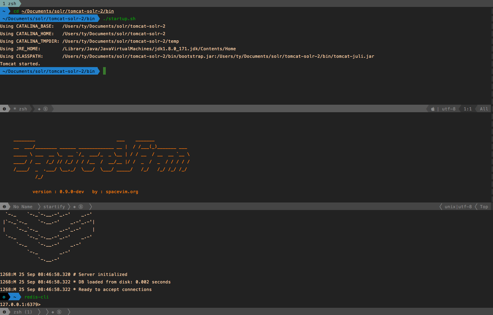
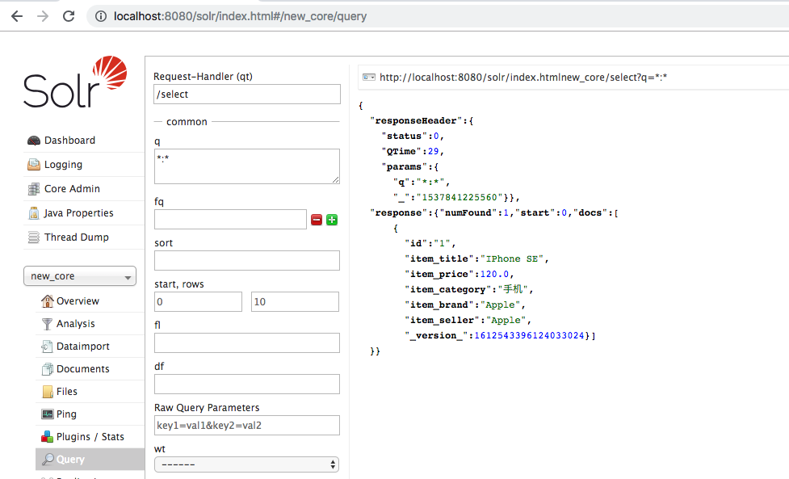
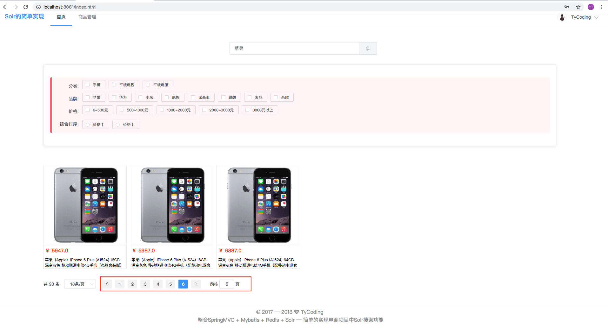
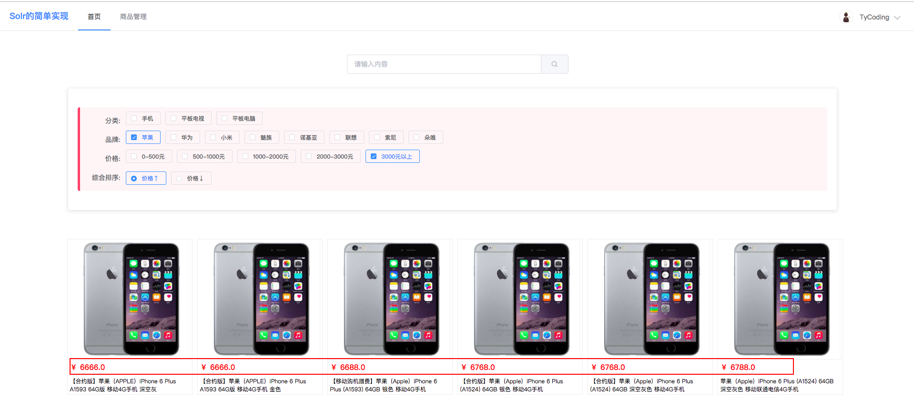
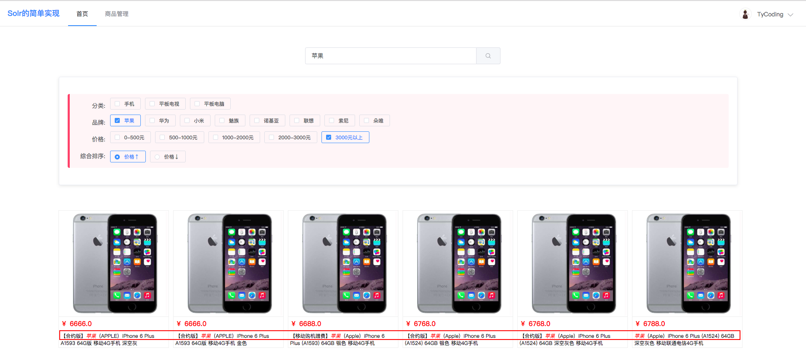
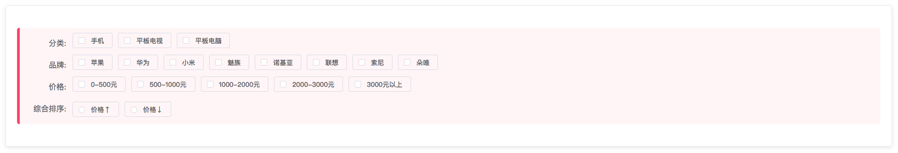
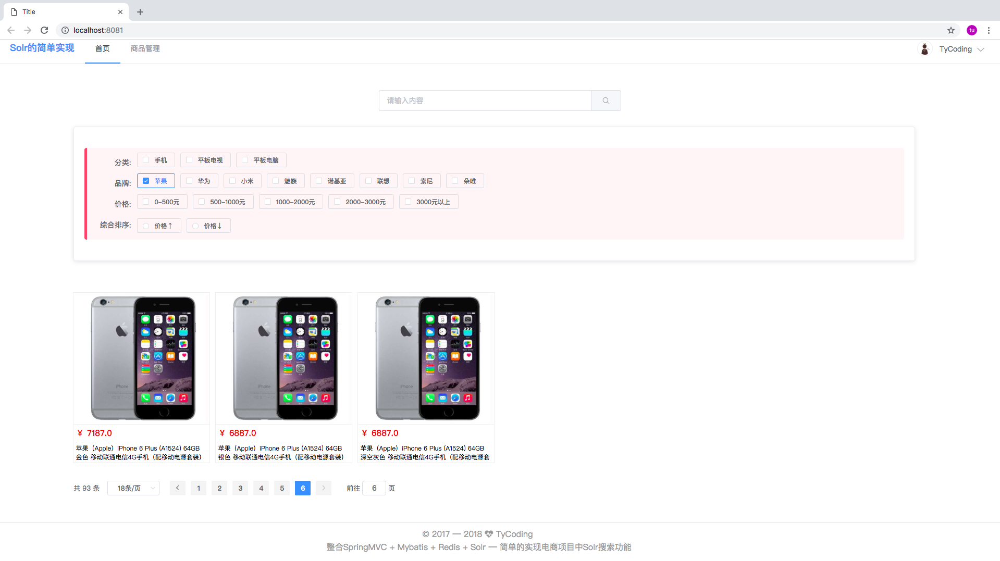
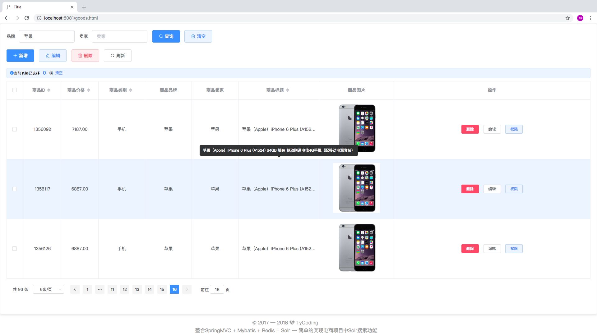
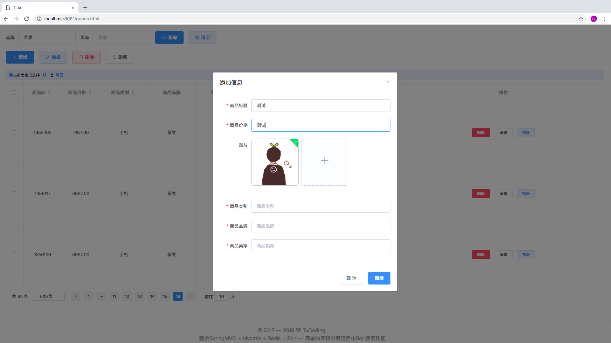

**手摸手教你优雅的实现电商项目中的Solr搜索功能，整合SSM框架和Shiro安全框架；教你用Vue.JS和ElementUI写出超漂亮的页面**

**技术栈**

* 后端： SSM + Shiro + Redis + Solr

* 前端： Vue.JS + ElementUI

**测试环境**

IDEA + Maven + Tomcat8

**项目设计**

```
ssm-redis-solr
|-- src/main/java/cn.tycoding/
|   |-- controller -- springMVC-web层
|   |-- credentials -- shiro密码加密验证服务类CredentialsMatcher,用于登录错误次数限制
|   |-- entity -- javaBean实体类
|   |-- mapper -- mybatis-mapper层接口和XML映射文件
|   |-- realm -- shiro自定义Realm实现类
|   |-- service -- service服务层接口
|       |-- impl -- service服务层接口实现类
|   |-- utils -- 通用util工具类
|-- src/main/resources/
|   |-- mybatis -- mybatis配置文件
|   |-- other -- 一些存放参数的配置文件
|   |-- spring -- spring集成shiro,myabtis,mvc,redis,solr的配置文件
|-- src/main/webapp/
|   |-- static -- 前端静态依赖文件
|   |-- WEB-INF -- web.xml
```

<br/>

# 准备

## Shiro

关于Shiro，我这里写了详细的SSM框架整合Shiro安全框架的文档，利用SSM框架+Shiro框架实现用户-角色-权限管理系统；

详细的文档地址：[SSM整合Shiro框架后的开发](http://tycoding.cn/2018/09/18/ssm-shiro/)

项目Github源码地址：[SSM整合Shiro框架后的开发](https://github.com/TyCoding/shiro)， 欢迎star

<br/>

## Solr & Spring-Data-Solr

** 关于Solr安装配置和Spring-Data-Solr的入门Demo请查看博文：[Solr和Spring-Data-Solr的入门学习](http://tycoding.cn/2018/09/24/solr/) **

Solr需要单独部署到Tomcat服务器上，我这里提供自己已经安装和配置好的Tomcat和Solr: [Github](https://github.com/TyCoding/solr-tomcat)

**注意事项：**

1. 部署Solr的Tomcat端口和本地项目的端口不能相同，会冲突。

2. 注意[Github仓库](https://github.com/TyCoding/solr-tomcat)中`solr-tomcat/webapps/solr/WEB-INF/web.xml`中solrhome的位置要修改为自己的。

<br/>

## Redis & Spring-Data-Redis

关于Redis安装配置和Spring-Data-Redis的入门Demo请查看博文：[Redis和Spring-Data-Redis的入门学习](http://tycoding.cn/2018/09/24/redis/)

<br/>

# 起步

## 启动Solr和Redis



如果访问`localhost:8080/solr/index.html`出现Solr Admin页则启动成功。

<br/>

## 初始化表结构

```sql
CREATE DATABASE ssm_redis DEFAULT CHARACTER SET utf8;
```

具体的数据库约束文件和表数据请看：[ssm-redis-solr/db](https://github.com/TyCoding/ssm-redis-solr/tree/master/db)

这里我们模拟添加了**934条**商品数据

<br/>

## 搭建SSM-Shiro集成环境

具体的SSM整合Shiro的教程请看我这个项目: [手摸手教你SSM整合Shiro](https://github.com/TyCoding/shiro)。这里不再说SSM整合Shiro的教程，默认认为已经大家已经完成。

<br/>

## 搭建SSM-Redis集成环境

集成SSM-Redis开发环境，首先你需要安装Redis并启动Redis-Server，然后就是在项目中搭建Spring-Data-Redis的运行环境：

<br/>

**创建redis-config.properties配置文件**

```xml
redis.host=127.0.0.1
redis.port=6379
redis.pass=
redis.database=0
redis.maxIdle=300
redis.maxWait=3000
redis.testOnBorrow=true
```

### 创建spring-redis.xml

```xml
<?xml version="1.0" encoding="UTF-8"?>
<beans xmlns="http://www.springframework.org/schema/beans"
       xmlns:xsi="http://www.w3.org/2001/XMLSchema-instance"
       xmlns:context="http://www.springframework.org/schema/context"
       xsi:schemaLocation="http://www.springframework.org/schema/beans
		http://www.springframework.org/schema/beans/spring-beans.xsd
		http://www.springframework.org/schema/context
		http://www.springframework.org/schema/context/spring-context.xsd">

    <context:property-placeholder location="classpath:other/*.properties"/>
    <!-- redis 相关配置 -->
    <bean id="poolConfig" class="redis.clients.jedis.JedisPoolConfig">
        <!-- 最大空闲数 -->
        <property name="maxIdle" value="${redis.maxIdle}"/>
        <!-- 连接时最大的等待时间（毫秒） -->
        <property name="maxWaitMillis" value="${redis.maxWait}"/>
        <!-- 在提取一个jedis实例时，是否提前进行验证操作；如果为true，则得到的jedis实例均是可用的 -->
        <property name="testOnBorrow" value="${redis.testOnBorrow}"/>
    </bean>
    <bean id="jedisConnectionFactory" class="org.springframework.data.redis.connection.jedis.JedisConnectionFactory">
        <property name="hostName" value="${redis.host}"/>
        <property name="port" value="${redis.port}"/>
        <property name="password" value="${redis.pass}"/>
        <property name="poolConfig" ref="poolConfig"/>
    </bean>

    <bean id="redisTemplate" class="org.springframework.data.redis.core.RedisTemplate">
        <property name="connectionFactory" ref="jedisConnectionFactory"/>
        <!-- 序列化策略 推荐使用StringRedisSerializer -->
        <property name="keySerializer">
            <bean class="org.springframework.data.redis.serializer.StringRedisSerializer"/>
        </property>
        <property name="valueSerializer">
            <bean class="org.springframework.data.redis.serializer.StringRedisSerializer"/>
        </property>
        <property name="hashKeySerializer">
            <bean class="org.springframework.data.redis.serializer.JdkSerializationRedisSerializer"/>
        </property>
        <property name="hashValueSerializer">
            <bean class="org.springframework.data.redis.serializer.JdkSerializationRedisSerializer"/>
        </property>
    </beans>
</beans>
```

配置文件我们已经在博文[Redis&Spring-Data-Redis入门](http://tycoding.cn/2018/09/24/redis/#more)中介绍过了，其中最需要关注的就是`hashKeySerializer`序列化配置。

如果你不添加序列化配置也是没影响的，但是存入Redis数据库中的KEY和VALUE值都是乱码的，当然是用Spring-Data-Redis是毫无影响的。

如果添加了序列化配置：配置值类型数据用`StringRedisSerializer`序列化方式；配置Hash类型数据用`JdkSerializationRedisSerializer`序列化方式。

<br/>

### 测试

```java
@RunWith(SpringJUnit4ClassRunner.class)
@ContextConfiguration(locations = {"classpath:spring/spring*.xml"})
public class TestRedisTemplate {
    @Autowired
    private RedisTemplate redisTemplate;
    @Test
    public void setValue(){
        redisTemplate.boundValueOps("name").set("tycoding");
    }
}
```

然后在`redis-cli`命令行窗口中输入`get name`就能得到VALUE为：tycoding。

至此，SSM集成Redis已经完成。

<br/>

## 搭建SSM-Solr集成环境

### 创建spring-solr.xml

```xml
<?xml version="1.0" encoding="UTF-8"?>
<beans xmlns="http://www.springframework.org/schema/beans"
       xmlns:xsi="http://www.w3.org/2001/XMLSchema-instance"
       xmlns:solr="http://www.springframework.org/schema/data/solr"
       xsi:schemaLocation="http://www.springframework.org/schema/data/solr
  		http://www.springframework.org/schema/data/solr/spring-solr-1.0.xsd
		http://www.springframework.org/schema/beans
		http://www.springframework.org/schema/beans/spring-beans.xsd">

    <!-- solr服务器地址 -->
    <solr:solr-server id="solrServer" url="http://127.0.0.1:8080/solr/new_core"/>
    <!-- solr模板，使用solr模板可对索引库进行CRUD的操作 -->
    <bean id="solrTemplate" class="org.springframework.data.solr.core.SolrTemplate">
        <constructor-arg ref="solrServer"/>
    </bean>
</beans>
```

spring-solr配置文件我们再博文[Solr&Spring-Data-Solr入门](http://tycoding.cn/2018/09/24/solr/)中我们已经介绍过了。其中最需要注意的就是solr服务器url地址的配置，组成结构一定要是：Ip + 端口 + solr项目名称 + core实例名称

### 测试

```java
@RunWith(SpringJUnit4ClassRunner.class)
@ContextConfiguration(locations = "classpath:spring/spring-solr.xml")
public class TestSolrTemplate {
    @Autowired
    private SolrTemplate solrTemplate;
    @Test
    public void testAdd() {
        Goods goods = new Goods(1L, "IPhone SE", "120", "手机", "Apple", "Apple");
        solrTemplate.saveBean(goods);
        solrTemplate.commit(); //提交
    }
}
```

关于Goods实体类定义，请看[/java/cn/tycoding/entity/Goods.java](https://github.com/TyCoding/ssm-redis-solr/blob/master/src/main/java/cn/tycoding/entity/Goods.java)
然后我们在浏览器中访问`localhost:8080/solr/index.html`，点击Query可以看到：



<br/>

# 开始

## 数据库数据批量导入Solr索引库

上面已经完成了SSM-Shiro-Redis-Solr的集成环境配置，那么思考：既然用Solr完成搜索功能，那么怎么实现呢？

以前我们直接请求数据库用`concat()`模糊查询实现搜索功能，但是这种方式有很大的弊端：1.给数据库造成的访问压力很大；2.无法识别用户查询的数据到底是`title`字段还是`price`字段...
如果用Solr完成搜索功能，就很容易解决了这些问题。那么我们需要往Solr索引库中添加数据，Sorl才能搜索出来数据呀：

```java
@Component
public class SolrUtil {
    @Autowired
    private GoodsMapper goodsMapper;
    @Autowired
    private SolrTemplate solrTemplate;

    /**
     * 实现将数据库中的数据批量导入到Solr索引库中
     */
    public void importGoodsData() {
        List<Goods> list = goodsMapper.findAll();
        System.out.println("====商品列表====");
        for (Goods goods : list) {
            System.out.println(goods.getTitle());
        }
        solrTemplate.saveBeans(list);
        solrTemplate.commit(); //提交
        System.out.println("====结束====");
    }
    public static void main(String[] args) {
        ApplicationContext context = new ClassPathXmlApplicationContext("classpath:spring/spring*.xml");
        SolrUtil solrUtil = (SolrUtil) context.getBean("solrUtil");
        solrUtil.importGoodsData();
    }
}
```

对应的Mapper.xml

```xml
<select id="findAll" resultType="cn.tycoding.entity.Goods">
    SELECT * FROM tb_item
</select>
```

目的就是查询数据库中所有数据，然后调用`solrTemplate.saveBean(List)`将查询到的List集合数据添加到Solr索引库中，之后我们在`localhost:8080/solr/index.html`中能查询出来共有934条记录数据。


<br/>

## 实现Solr搜索功能

### 前端

由于前端使用了[Vue.JS](https://cn.vuejs.org/v2/guide/)和[ElementUI](http://element-cn.eleme.io/#/zh-CN)，如果不了解的话请仔细阅读官方文档，或者，你可以查看我的博文记录: [Vue学习学习笔记](http://www.tycoding.cn/2018/07/27/vue-5/)

在[index.html](https://github.com/TyCoding/ssm-redis-solr/blob/master/src/main/webapp/index.html)中定义：

```html
<el-input placeholder="请输入内容" type="text" class="input-with-select" @keyup.enter.native="search" v-model="searchMap.keywords">
    <el-button slot="append" icon="el-icon-search" @click="search"></el-button>
</el-input>
```

在[index.js](https://github.com/TyCoding/ssm-redis-solr/blob/master/src/main/webapp/static/js/index.js)中定义：

```javascript
data() {
  return {
    searchMap: { keywords: '' }
  }
},
methods: {
  search() {
      this.$http.post('goods/search.do', this.searchMap).then(result => {
          this.goods = result.body.rows;
      });
  },
}
```

### 后端

在[GoodsController.java](https://github.com/TyCoding/ssm-redis-solr/blob/master/src/main/java/cn/tycoding/controller/GoodsController.java)中定义：

```java
@RequestMapping("/search")
public Map<String, Object> search(@RequestBody Map<String, Object> searchMap) {
    return goodsService.search(searchMap);
}
```

**为什么要用Map接收前端数据？**

如果前端传来的数据不止一个，且不属于后端的任何一个实体类对象，前端传来的仅是一个自定义的对象(`xx:{}`)；那么后端势必不能通过实体类对象来接收，且是POST请求，后端必须也使用对象类型来接收数据且必须用`@RequestBody`标识对象，原因：

1. 前端传来的数据不止一种。
2. 前端传来的数据封装在对象中。

所以，综上，Map<K, V>这种数据结构最适合作为接收对象类型。

<br/>

在[GoodsServiceImpl.xml](https://github.com/TyCoding/ssm-redis-solr/blob/master/src/main/java/cn/tycoding/service/impl/GoodsServiceImpl.java)中定义：

```java
public Map<String, Object> search(Map searchMap) {
  Map<String, Object> map = new HashMap<String, Object>();
  Query query = new SimpleQuery();
  //添加查询条件
  Criteria criteria = new Criteria("item_keywords").is(searchMap.get("keywords"));
  query.addCriteria(criteria);
  ScoredPage<Goods> page = solrTemplate.queryForPage(query, Goods.class);
  map.put("rows", page.getContent()); //返回查询到的数据
  return map;
}
```

启动项目，再搜索框中输入`苹果`回车即出现：


但是发现页面中只显示10条数据（实际我们添加的苹果手机数据不止10条），为了更优雅的显示，我们实现分页

<br/>

#### 实现分页查询

在后端中我们用`limit`方式显示分页，或者更简单的用Mybatis的`PageHelper`分页查询实现分页查询。
而，我们在博文[Solr&Spring-Data-Solr入门学习](http://www.tycoding.cn/2018/09/24/solr/)中讲了Solr分页查询的方式：

修改[GoodsServiceImpl.java](https://github.com/TyCoding/ssm-redis-solr/blob/master/src/main/java/cn/tycoding/service/impl/GoodsServiceImpl.java)

```java
public Map<String, Object> search(Map searchMap) {
    Map<String, Object> map = new HashMap<String, Object>();
    Query query = new SimpleQuery();
    //添加查询条件
    Criteria criteria = new Criteria("item_keywords");
    if (searchMap.get("keywords") != null && searchMap.get("keywords") != ""){
        System.out.println("执行了...");
        criteria.is(searchMap.get("keywords"));
    }
    query.addCriteria(criteria);

    //分页查询
    Integer pageCode = (Integer) searchMap.get("pageCode");
    if (pageCode == null) {
        pageCode = 1; //默认第一页
    }
    Integer pageSize = (Integer) searchMap.get("pageSize");
    if (pageSize == null) {
        pageSize = 18; //默认18
    }
    query.setOffset((pageCode - 1) * pageSize); //从第几条记录开始查询：= 当前页 * 每页的记录数
    query.setRows(pageSize);
    ScoredPage<Goods> page = solrTemplate.queryForPage(query, Goods.class);
    map.put("rows", page.getContent()); //返回查询到的数据
    map.put("totalPage", page.getTotalPages()); //返回总页数
    map.put("total", page.getTotalElements()); //返回总记录数
    return map;
}
```

##### 前端

ElementUI提供了分页查询的插件，我们仅需要传给它几个参数，即可实现分页，详细的文档介绍请看我这篇博文：[Vue+ElementUI实现分页](http://www.tycoding.cn/2018/07/30/vue-6/)

在[index.html](https://github.com/TyCoding/ssm-redis-solr/blob/master/src/main/webapp/index.html)中添加：

```html
<el-pagination
        background
        @size-change="handleSizeChange"
        @current-change="handleCurrentChange"
        :current-page="pageConf.pageCode"
        :page-sizes="pageConf.pageOption"
        :page-size="pageConf.pageSize"
        layout="total, sizes, prev, pager, next, jumper"
        :total="pageConf.totalPage">
</el-pagination>
```

在[index.js](https://github.com/TyCoding/ssm-redis-solr/blob/master/src/main/webapp/static/js/index.js)中添加：

```javascript
data() {
  return {
    searchMap: {
        keywords: '',

        //分页选项
        pageCode: '', //当前页
        pageSize: '', //每页的记录数
    }
    pageConf: {
        //设置一些初始值(会被覆盖)
        pageCode: 1, //当前页
        pageSize: 18, //每页显示的记录数
        totalPage: 20, //总记录数
        pageOption: [18, 25, 30], //分页选项
    },
  }
},
methods: {
    //pageSize改变时触发的函数
    handleSizeChange(val) {
        console.log(val);
        this.searchMap.pageSize = val;
        this.searchMap.pageCode = this.pageConf.pageCode;
        this.search(this.pageConf.pageCode, val);
    },
    //当前页改变时触发的函数
    handleCurrentChange(val) {
        console.log(val);
        this.searchMap.pageCode = val;
        this.searchMap.pageSize = this.pageConf.pageSize;
        this.search(val, this.searchMap.pageSize);
    },
}
```

我们只需要修改以上JavaScript代码即可，因为`search`方法传给后台的是`searchMap`这个对象数据，只要其中包含了`pageCode`和`pageSize`这两个参数，就会被封装到后端接收的Map集合中。
其中点击上一页，下一页按钮触发的函数在`<el-pagination>`中已经定义了，如果点击上一页下一页触发`handleCurrentChange()`函数，如果点击每页5条记录变成10条记录就会触发`handleSizeChange()`函数；两个函数都又调用了`search()`方法，当点击分页按钮时就发送数据给后端，其中包含当前点击的`pageCode`和`pageSize`的值，后端接收到这两个值进行分页计算，并将数据返回给前端。



<br/>

#### 实现条件过滤

上面讲了分页查询，仅仅是单方面的查询，并没有任何条件限制。这一功能在SSM中我们直接通过`concat()`模糊条件过滤，但在Solr中提供了`FilterQuery()`实现条件过滤查询：

修改[GoodsServiceImpl.java](https://github.com/TyCoding/ssm-redis-solr/blob/master/src/main/java/cn/tycoding/service/impl/GoodsServiceImpl.java)文件，在`search()`方法中添加：

```java
      if (searchMap.get("category") != null) {
          if (!searchMap.get("category").equals("")) {
              System.out.println("执行了category");
              FilterQuery filterQuery = new SimpleFilterQuery();
              Criteria filterCriteria = new Criteria("item_category").is(searchMap.get("category"));
              filterQuery.addCriteria(filterCriteria);
              query.addFilterQuery(filterQuery);
          }
      }

      //按品牌过滤
      if (searchMap.get("brand") != null) {
          if (!searchMap.get("brand").equals("")) {
              System.out.println("执行了brand...");
              FilterQuery filterQuery = new SimpleFilterQuery();
              Criteria filterCriteria = new Criteria("item_brand").is(searchMap.get("brand"));
              filterQuery.addCriteria(filterCriteria);
              query.addFilterQuery(filterQuery);
          }
      }
```

##### 前端

修改[index.html](https://github.com/TyCoding/ssm-redis-solr/blob/master/src/main/webapp/index.html)

```html
<el-checkbox-group :max="1" v-model="change.category" @change="selectMethod">
    <el-checkbox v-for="classify in classifyData.category" :label="classify" border size="mini">{{classify}}</el-checkbox>
</el-checkbox-group>
<el-checkbox-group :max="1" v-model="change.brand" @change="selectMethod">
    <el-checkbox v-for="classify in classifyData.brand" :label="classify" border size="mini">{{classify}}</el-checkbox>
</el-checkbox-group>
```

修改[index.js](https://github.com/TyCoding/ssm-redis-solr/blob/master/src/main/webapp/static/js/index.js)

```javascript
searchMap: {
  brand: '',
  price: '',
}

//checkbox选择的选项
change: {
    category: [],
    brand: [],
    price: []
},

selectMethod(val) {
    this.searchMap.category = this.change.category[0];
    this.searchMap.brand = this.change.brand[0];
    this.search(); //每次点击后都进行查询
},
```

<br/>

#### 实现商品价格升降过滤

修改[GoodsServiceImpl.java](https://github.com/TyCoding/ssm-redis-solr/blob/master/src/main/java/cn/tycoding/service/impl/GoodsServiceImpl.java)中的`search`方法:

```java
  //按价格的升降序查询
  if (searchMap.get("sort") != null) {
      if (!searchMap.get("sort").equals("")) {
          String sortValue = (String) searchMap.get("sort");
          String sortField = (String) searchMap.get("field");
          if (sortValue != null && !sortValue.equals("")) {
              if (sortValue.equals("asc")) {
                  Sort sort = new Sort(Sort.Direction.ASC, "item_" + sortField);
                  query.addSort(sort);
              }
              if (sortValue.equals("desc")) {
                  Sort sort = new Sort(Sort.Direction.DESC, "item_" + sortField);
                  query.addSort(sort);
              }
          }
      }
  }
```

##### 前端

修改[index.html](https://github.com/TyCoding/ssm-redis-solr/blob/master/src/main/webapp/index.html)：

```html
<el-checkbox-group v-model="change.price" :max="1" @change="selectMethod">
        <el-checkbox :label="'0-500'" border size="mini">0-500元</el-checkbox>
        <el-checkbox :label="'500-1000'" border size="mini">500-1000元</el-checkbox>
        ...
</el-checkbox-group>
```

修改[index.js](https://github.com/TyCoding/ssm-redis-solr/blob/master/src/main/webapp/static/js/index.js)

```javascript
searchMap: {
  price: '',
}

selectMethod(val) {
  this.searchMap.price = this.change.sort[0];
}
```



<br/>

#### 实现查询结果高亮显示

实现高亮显示，我们先看一下效果：



可看到根据关键字`苹果`查询出来的记录中`苹果`字样都被标记为红色斜体样式，这即是我们的目的，你可以查看淘宝的查询，也是查询字样以红色显示出来。

如果使用高亮查询，那么之前的`Query query = new SimpleQuery()`就不在满足需求了；高亮查询使用`HighlightQuery query = new SimpleHighlightQuery();`

修改[GoodsServiceImpl.java](https://github.com/TyCoding/ssm-redis-solr/blob/master/src/main/java/cn/tycoding/service/impl/GoodsServiceImpl.java)中的`Search()`方法：

```java
    HighlightQuery query = new SimpleHighlightQuery();
    HighlightOptions highlightOptions = new HighlightOptions().addField("item_title"); //设置高亮的域
    highlightOptions.setSimplePrefix("<em style='color: red'>"); //设置高亮前缀
    highlightOptions.setSimplePostfix("</em>"); //设置高亮后缀
    query.setHighlightOptions(highlightOptions); //设置高亮选项
```
初始化高亮查询`HighlightQuery`类，利用其包含的`setSimplePerfix`设置查询结果的前缀html标签，利用`setSimplePostfix`设置查询结果后缀HTML标签。

循环高亮查询结果集合数据：

```java
    HighlightPage<Goods> page = solrTemplate.queryForHighlightPage(query, Goods.class);
    //循环高亮入口集合
    for (HighlightEntry<Goods> h : page.getHighlighted()) {
        Goods goods = h.getEntity(); //获取原实体类
        if (h.getHighlights().size() > 0 && h.getHighlights().get(0).getSnipplets().size() > 0) {
            goods.setTitle(h.getHighlights().get(0).getSnipplets().get(0)); //设置高亮的结果
        }
    }
```
之前我们可以直接通过`query.getContent()`获取到查询结果，但是使用了高亮查询`HighlightQuery`就不能直接通过`getContent()`获取数据了，我们要手动遍历`HighlightPage`这个对象，他是一个层层嵌套的集合数据，详细数据结构这里不再说了。

<br/>

## 更新索引

既然使用了Solr管理商品数据，查询时直接从Solr索引库中查询数据，而不是查询数据库中的数据，那么如果修改了商品的信息：添加、删除、修改。那么就必须同步使Solr索引库中的数据和数据库中的数据保持一致才能实现查询出来的数据是真实的。

所以我们要在对商品添加、删除、修改的时候同步更新Solr索引库数据：

修改[GoodsServiceImpl.java](https://github.com/TyCoding/ssm-redis-solr/blob/master/src/main/java/cn/tycoding/service/impl/GoodsServiceImpl.java)中`create`、`delete`、`update`方法，更新Solr索引库：

```java
    @Override
    public void create(Goods goods) {
        goodsMapper.create(goods);

        Long id = goodsMapper.maxId(); //获取根据主键自增插入的最新一条记录的ID值
        goods.setId(id);

        //更新索引库
        solrTemplate.saveBean(goods);
        solrTemplate.commit();
    }

    @Override
    public void update(Goods goods) {
        goodsMapper.update(goods);

        //更新索引库
        solrTemplate.deleteById(String.valueOf(goods.getId()));
        solrTemplate.commit();
        List<Goods> list = new ArrayList<Goods>();
        list.add(goods);
        solrTemplate.saveBeans(list);
        solrTemplate.commit();
    }

    @Override
    public void delete(Long... ids) {
        for (Long id : ids) {
            goodsMapper.delete(id);

            //更新索引库
            solrTemplate.deleteById(String.valueOf(id));
            solrTemplate.commit();
        }
    }
```

注意，在添加商品时，传来的实体类中并不包含Id属性数据，因为我们使用了MySql的自增主键;而想要向Solr索引库中添加新数据又必须制定Id属性值，因为Solr不会自增主键呀。所以我们在`goodsMapper.create()`后调用`MaxId()`方法获取最新自增的主键值，其在Mapper.xml中定义：

```xml
<select id="maxId" resultType="Long">
    SELECT MAX(id) FROM tb_item
</select>
```

<br/>

## 关于Redis

眼看着教程就结束了，但是为什么教程中没有解释Redis的应用呢？

**解释**

关于SSM整合Redis的教程请仔细看我的博文：[Redis和Spring-Data-Redis入门学习](http://www.tycoding.cn/2018/09/24/redis/)。

因为Redis在本项目中并没有用到实际的应用中，为何？首先我们要考虑为什么要用Redis？

Redis缓存嘛，不就是缓存哪些大批量的数据减轻服务器压力的。但是，并不是说所有的大批量的数据都得去缓存，虽然我们项目中的*商品管理功能*中已经出现了900多条数据，但是这些数据都需要频繁的正删改，而缓存技术中一个难点就是缓存同步问题，你的缓存数据必须时刻和数据库（真实的数据）保持一致，如果每修改一条记录就去更新一遍缓存势必会给缓存服务器造成很大压力。

什么数据适合放进缓存？不常修改的数据。比如商品的分类列表数据：



但是原谅我，我只是想简单的实现以下Solr的搜索功能，真实项目中商品的分类数据肯定是存在另一张表中，由于我并没有实现，所以Redis在本项目中的应用就比较少了。


<br/>

# 项目截图









<br/>

# 交流

如果大家有兴趣，欢迎大家加入我的Java交流群：671017003 ，一起交流学习Java技术。博主目前一直在自学JAVA中，技术有限，如果可以，会尽力给大家提供一些帮助，或是一些学习方法，当然群里的大佬都会积极给新手答疑的。所以，别犹豫，快来加入我们吧！  

<br/>

# 联系

If you have some questions after you see this article, you can contact me or you can find some info by clicking these links.

- [Blog@TyCoding's blog](http://www.tycoding.cn)
- [GitHub@TyCoding](https://github.com/TyCoding)
- [ZhiHu@TyCoding](https://www.zhihu.com/people/tomo-83-82/activities)
